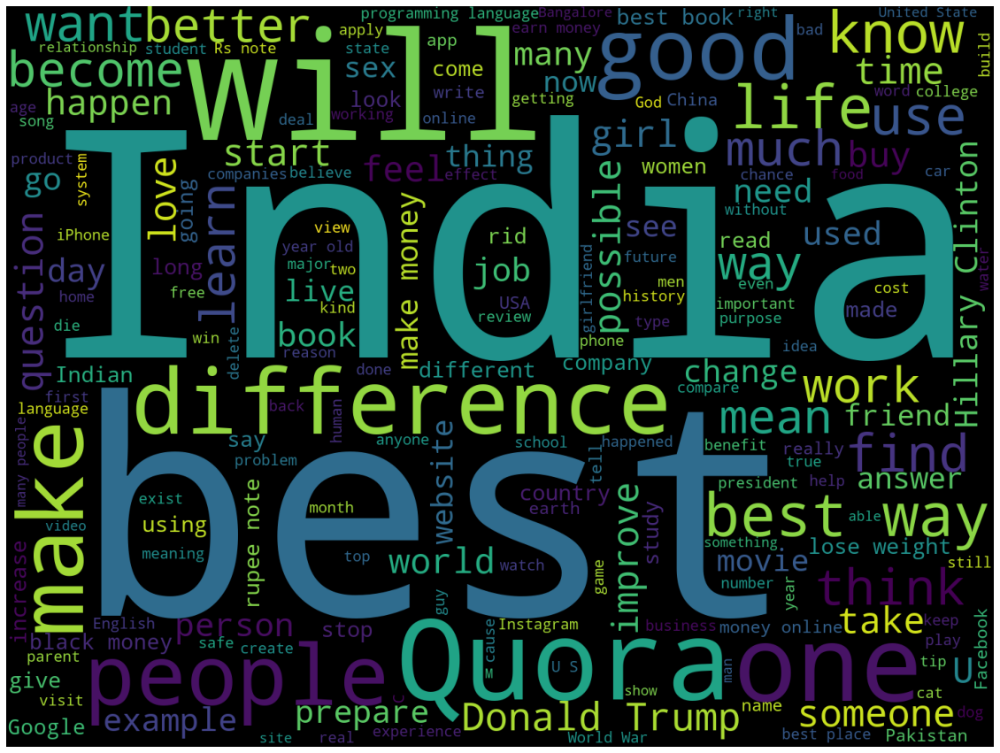

# Quora Duplicate Questions Detection

The repo with instructions for Project deplicate question detection

Welcome!

## Description

Over 100 million people visit Quora every month, so it's no surprise that many people ask similar (or the same) questions. Various questions with the same intent can cause people to spend extra time searching for the best answer to their question, and results in members answering multiple versions of the same question. Quora uses random forest to identify duplicated questions to provide a better experience to active seekers and writers, and offer more value to both of these groups in the long term. Follow the steps outlined below to build the appropriate classifier model.

## Data

The labeled dataset can be downloaded from [here](https://drive.google.com/file/d/19iWVGLBi7edqybybam56bt2Zy7vpf1Xc/view?usp=sharing).

## Project WorkFlow

## Exploratory Data Analysis

### Overview of the dataset

* There are about 480,000 questions and 68% questions appears only once.13% appear multiple times.
* This is also an Imbalanced Dataset: There is 63% question pairs are not duplicate.
* 80:20 split on training and testing dataset.

### Characters and Words 

* Characters count vary mostly from 25 to 80.
* Most questions have 58 characters. 
* Word Count has a similar distribution. Most questions are 10 words long. 

## Feature Engineering and Model Selection
* Normalization: Sparse matrix of occurrence counts using tf-idf vectorization
* Baseline Model: Logistic Regression: 
73.5% accuracy score
* XGBoost Classifier with tf-idf ;
 87% accuracy score and 88.4% recall

